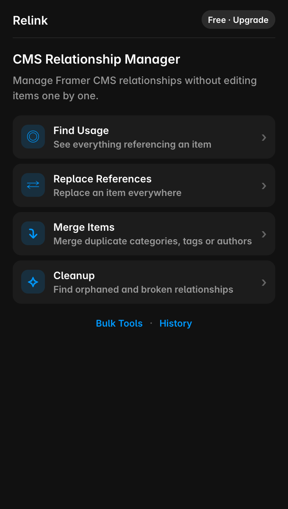
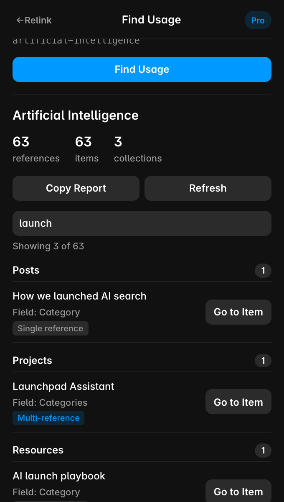
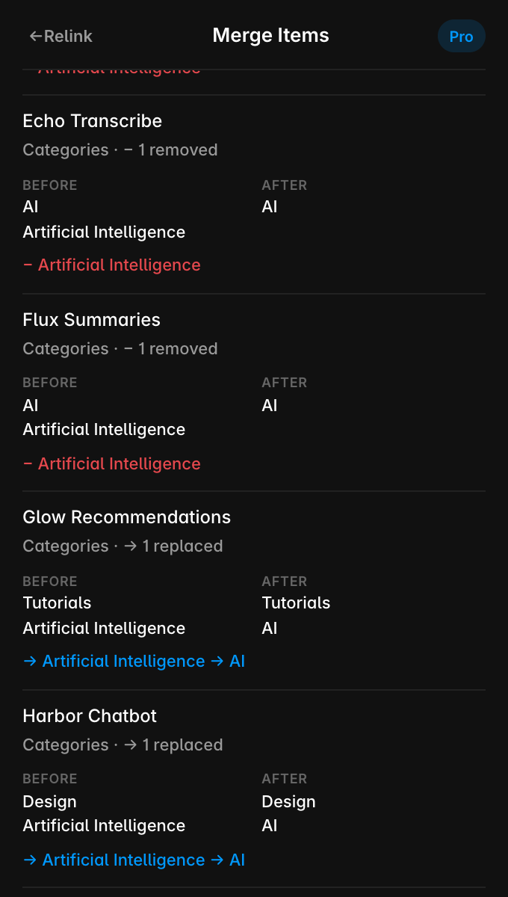
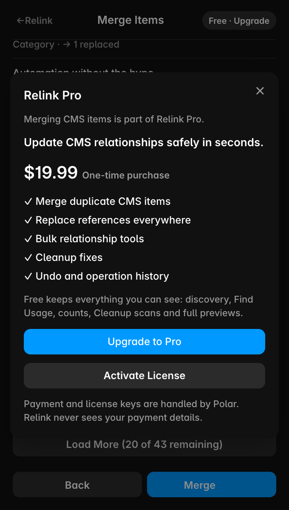

# Relink for Framer

**Manage Framer CMS relationships without editing items one by one.**

Relink is a Framer plugin for the reference and multi-reference fields that connect your CMS collections. Find where an item is used, replace or merge it everywhere, and clean up duplicate, orphaned and broken references, with a preview of every change and Undo.

  
  
  

## What it does

- **Find Usage.** Pick any CMS item and see everything that references it, grouped by collection, with a Go to Item link for each.
- **Replace References.** Swap one item for another in every collection that references it.
- **Merge Items.** Move every reference from a duplicate category, tag or author to the one you keep. If an item already references both, it keeps a single reference.
- **Cleanup.** Find orphaned items, multi-reference fields that list the same item twice, and references to items that no longer exist.
- **Bulk tools.** Add, remove or replace one reference across many selected items.
- **Preview, re-check, verify.** Every change is previewed field by field. Right before writing, Relink re-reads the CMS and skips items that changed since the preview; after writing, it reads the values back to verify them.
- **History and Undo.** Operations are recorded on your device. Undo restores what still holds Relink's change and reports anything edited since, without overwriting it.

Relink only changes reference fields. It never edits titles, text, images or other content.

## Free and Pro

| Free | Pro ($19.99, one-time purchase) |
|---|---|
| CMS relationship discovery | Everything in Free |
| Find Usage and usage counts | Apply Replace References |
| Orphan, duplicate and broken-reference detection | Merge Items |
| Full preview of every operation | Bulk Add, Remove and Replace |
| | Cleanup fixes |
| | History and Undo |

**[Buy Relink Pro: $19.99, one-time](https://buy.polar.sh/polar_cl_yehW1JK1BsHL0I1Ee2wrCQgntjBmwZGJ20lhJ1kTsTB)**

It's a one-time payment, with no subscription. Payment is handled by [Polar](https://polar.sh), the merchant of record. You receive a license key by email. To activate it, open Relink in Framer and choose **Free · Upgrade → Activate License**.

## Get the plugin

Relink is coming to the Framer Marketplace. This page will link to it as soon as it's published.

Found a bug? [Open an issue](https://github.com/AbdessamadAbouz/Relink/issues/new).

## Privacy

Relink runs inside Framer and works with your CMS only through Framer's Plugin API. It has no server for your CMS data and never sends your content anywhere. Undo history stays in your browser. More details are in the [privacy policy](PRIVACY.md).

## Support

Questions, problems, or license help: **abdessamad.abouz@gmail.com**

If something doesn't work as expected, please describe the collections and fields involved. Terms and refunds: [TERMS.md](TERMS.md).
